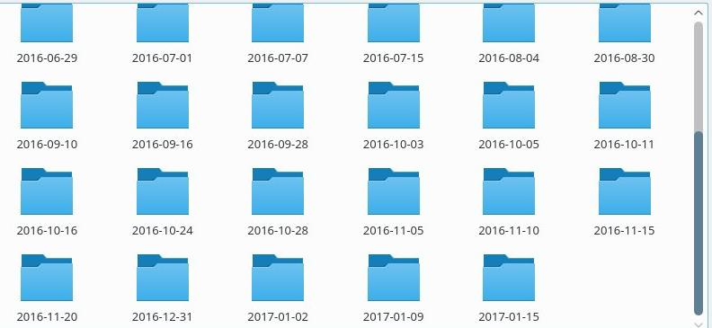

# Bash-Scripts
Useful bash scripts

Please correct the hardcoded directories of your scripts, and then you can run them :-)

Run them using "bash scriptxxxx"

## backupMultipleFoldersIncrementally

Creates remote or local incremental backups. The new backup folders are created by only uploading the changed content and creating **hardlinks** for the rest. The backup directory will look something like:
