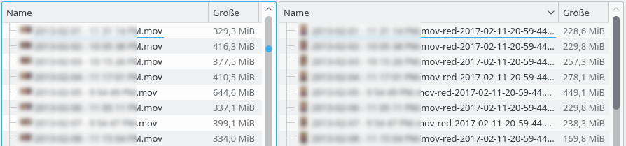

# Bash-Scripts
Useful bash scripts

Please correct the hardcoded directories of your scripts, and then you can run them :-)

Run them using "bash scriptxxxx"

## backupMultipleFoldersIncrementally

Creates remote or local incremental backups. The new backup folders are created by only uploading the changed content and creating **hardlinks** for the rest. The backup directory will look something like:

## convert-videos

Converts all videos from a directory (recursively) with ffmpeg to arbitrary formats. 

* Output in a separate or source folder (respecting & creating the subfolders)
* Works for Audio (mp3, ogg,...) and Video (avi, mp4, mkv,...)
* Comparison of filesizes before & after and warning if no reduction was achieved
* Naming conventions and ffmpeg details can be changed with parameters (or in the script)
* creates log file (with size difference and code to move old files to the trash)

